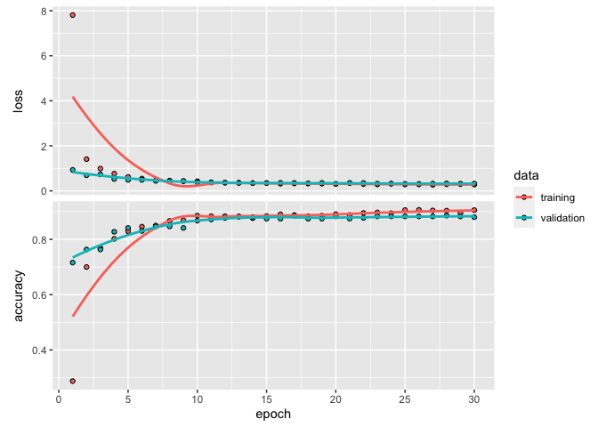
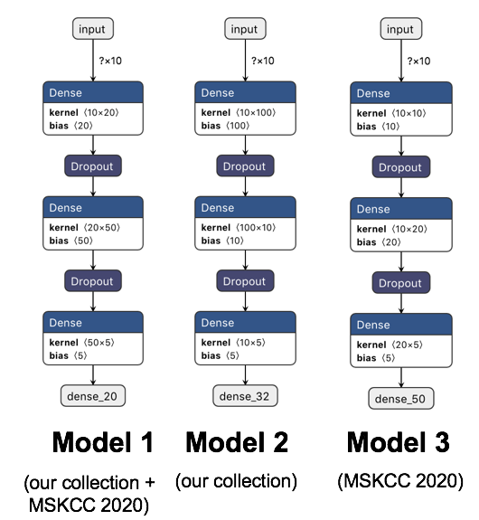
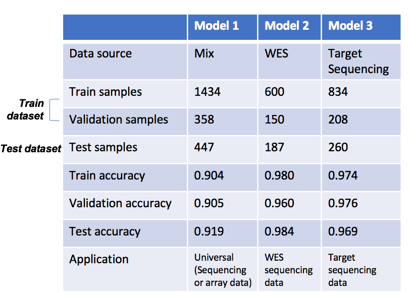

<!-- README.md is generated from README.Rmd. Please edit that file -->

# sigminer.prediction

<!-- badges: start -->

[](https://www.tidyverse.org/lifecycle/#experimental)
<!-- badges: end -->

Mutational signatures represent mutational processes occured in cancer
evolution, thus are stable and genetic resources for subtyping. This
tool provides functions for training neutral network models to predict
the subtype a sample belongs to based on ‘keras’ and
[‘sigminer’](https://github.com/ShixiangWang/sigminer) packages.

> This is part of **sigminer** project.

## Installation

You can install the **sigminer.prediction** from **GitHub** with::

``` r
# install.packages("remotes")
remotes::install_github("ShixiangWang/sigminer.prediction")
```

Keras package and library are required.

``` r
install.packages("keras")
keras::install_keras()
```

## Usage

``` r
library(sigminer.prediction)
#> Loading required package: keras
```

Load data from our group study.

``` r
load(system.file("extdata", "wang2020-input.RData",
  package = "sigminer.prediction", mustWork = TRUE
))
```

Prepare data.

``` r
dat_list <- prepare_data(expo_all,
  col_to_vars = c(paste0("Sig", 1:5), paste0("AbsSig", 1:5)),
  col_to_label = "enrich_sig",
  label_names = paste0("Sig", 1:5)
)
```

Construct *Keras* model and fit with train and test datasets.

``` r
res <- modeling_and_fitting(dat_list, 20, 0, 20, 0.1)
```

> See `?modeling_and_fitting` for more.

Plot modeling history.

``` r
res$history[[1]] %>% plot()
#> `geom_smooth()` using formula 'y ~ x'
```



Load the model and use it to predict.

``` r
model <- load_model_hdf5(res$model_file)

## You can set other data here
model %>% predict_classes(dat_list$x_train[1, , drop = FALSE])
#> [1] 4
model %>% predict_proba(dat_list$x_train[1, , drop = FALSE])
#>             [,1]         [,2]         [,3]       [,4]      [,5]
#> [1,] 0.003054357 0.0002446828 2.334113e-05 0.00365585 0.9930218
```

If you input wrong data shape, it will return error and remind you the
correct shape.

``` r
# Use a 9 numbers input
model %>% predict_classes(dat_list$x_train[1, 1:9, drop = FALSE])
#> Error in py_call_impl(callable, dots$args, dots$keywords): ValueError: Error when checking input: expected dense_input to have shape (10,) but got array with shape (9,)
#> 
#> Detailed traceback: 
#>   File "/Users/wsx/Library/r-miniconda/envs/r-reticulate/lib/python3.6/site-packages/tensorflow_core/python/keras/engine/sequential.py", line 327, in predict_classes
#>     proba = self.predict(x, batch_size=batch_size, verbose=verbose)
#>   File "/Users/wsx/Library/r-miniconda/envs/r-reticulate/lib/python3.6/site-packages/tensorflow_core/python/keras/engine/training.py", line 909, in predict
#>     use_multiprocessing=use_multiprocessing)
#>   File "/Users/wsx/Library/r-miniconda/envs/r-reticulate/lib/python3.6/site-packages/tensorflow_core/python/keras/engine/training_v2.py", line 462, in predict
#>     steps=steps, callbacks=callbacks, **kwargs)
#>   File "/Users/wsx/Library/r-miniconda/envs/r-reticulate/lib/python3.6/site-packages/tensorflow_core/python/keras/engine/training_v2.py", line 396, in _model_iteration
#>     distribution_strategy=strategy)
#>   File "/Users/wsx/Library/r-miniconda/envs/r-reticulate/lib/python3.6/site-packages/tensorflow_core/python/keras/engine/training_v2.py", line 594, in _process_inputs
#>     steps=steps)
#>   File "/Users/wsx/Library/r-miniconda/envs/r-reticulate/lib/python3.6/site-packages/tensorflow_core/python/keras/engine/training.py", line 2472, in _standardize_user_data
#>     exception_prefix='input')
#>   File "/Users/wsx/Library/r-miniconda/envs/r-reticulate/lib/python3.6/site-packages/tensorflow_core/python/keras/engine/training_utils.py", line 574, in standardize_input_data
#>     str(data_shape))
```

For constructing a batch of models, see `?batch_modeling_and_fitting`.

## Trained models for prostate cancer

In our prostate cancer study, we trained 3 models for different datasets
for different clinical applification. Each model is selected as the best
model by hand from parameter combination matrix (576 models) according
to comprehensive consideration of accuracy in test dataset, average
accuracy in all datasets and number of parameters used:

``` r
mat <- expand.grid(
  c(10, 20, 50, 100),
  c(0, 0.1, 0.2, 0.3, 0.4, 0.5),
  c(10, 20, 50, 100),
  c(0, 0.1, 0.2, 0.3, 0.4, 0.5)
)

nrow(mat)
#> [1] 576
head(mat)
#>   Var1 Var2 Var3 Var4
#> 1   10  0.0   10    0
#> 2   20  0.0   10    0
#> 3   50  0.0   10    0
#> 4  100  0.0   10    0
#> 5   10  0.1   10    0
#> 6   20  0.1   10    0
```

The models have same 5-layer structure: **input layer + hidden layer + 2
dropout layers + output layer**. The dropout layers are used to control
overfitting. The hidden layer is used to extract hidden pattern in data.
This is the core model structure used in this package. If users want to
use custom model structure, you have to define it by yourself, the
source code of `modeling_and_fitting()` can be
reference.

<div class="figure" style="text-align: center">



<p class="caption">

Structure of 3 selected trained models for different datasets

</p>

</div>

The performance of the three selected model has shown below.

> We randomly selected 80% of total samples for training and 20% of
> total samples for testing the performance. We trained 50 epochs with
> batch size 16. At each epoch, 20% of trained samples were randomly
> selected as the validation
dataset.

<div class="figure" style="text-align: center">



<p class="caption">

Performance of 3 selected Keras models at the last (generated from
20200409)

</p>

</div>

### Usage of trained model

List information for available models.

``` r
list_trained_models()
#> # A tibble: 3 x 9
#>   Index TargetCancerType Application Cohort AccuracyTrainLa… AccuracyValLast
#>   <int> <chr>            <chr>       <chr>             <dbl>           <dbl>
#> 1     1 PRAD             Universal   Combi…            0.904           0.905
#> 2     2 PRAD             WES         Wang …            0.98            0.96 
#> 3     3 PRAD             Target Seq… MSKCC…            0.974           0.976
#> # … with 3 more variables: AccuracyTest <dbl>, Date <date>, ModelFile <chr>
```

Get the corresponding model by passing a subset data to
`load_trained_model()`:

``` r
md_all <- list_trained_models() %>% 
  head(1) %>% 
  load_trained_model()
md_all
#> Model
#> Model: "sequential"
#> ________________________________________________________________________________
#> Layer (type)                        Output Shape                    Param #     
#> ================================================================================
#> dense (Dense)                       (None, 20)                      220         
#> ________________________________________________________________________________
#> dropout (Dropout)                   (None, 20)                      0           
#> ________________________________________________________________________________
#> dense_1 (Dense)                     (None, 50)                      1050        
#> ________________________________________________________________________________
#> dropout_1 (Dropout)                 (None, 50)                      0           
#> ________________________________________________________________________________
#> dense_2 (Dense)                     (None, 5)                       255         
#> ================================================================================
#> Total params: 1,525
#> Trainable params: 1,525
#> Non-trainable params: 0
#> ________________________________________________________________________________
```

> When the input have multiple rows, it will return a `list` of models.

``` r
md_all %>% predict_classes(dat_list$x_train[1, , drop = FALSE])
#> [1] 4
```

## Citation

-----

***Copy number signature analyses in prostate cancer reveal distinct
etiologies and clinical outcomes, under submission***

-----
